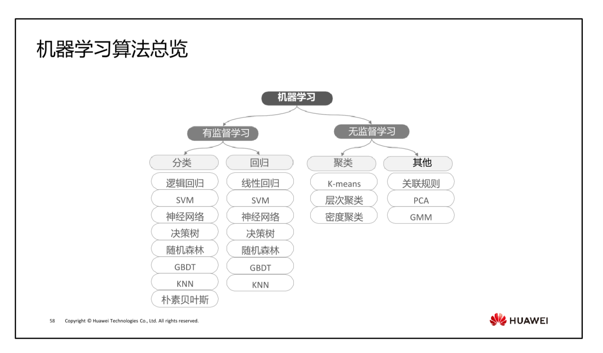

# 论文复现仓库

本仓库用于复现论文中的结构和代码。在这里，我将重新实现论文中提出的算法和模型，以验证论文的实验结果。

## 仓库说明
- 该仓库包含了论文复现所需的所有代码文件。
- 旨在提供可复现的实验环境和步骤。

# 仓库结构（待更新）
- fan
    - paper 
    - note
    - code
    - data

# 环境配置
- pytorch 3+
- pytorch 2.8

# python库
- scikit-learn 作用：用于模型评估、数据预处理等
pip install scikit-learn
- seaborn 作用：用于数据可视化，尤其是绘制混淆矩阵等
pip install seaborn
- matplotlib 作用：用于绘制图表、可视化数据
pip install matplotlib

  

